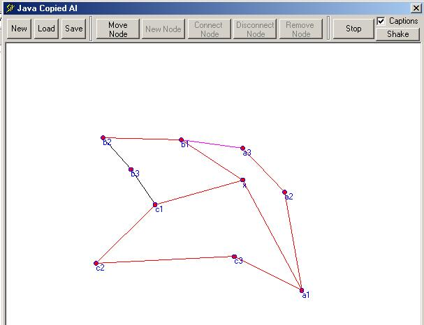



## Vb power Against Java

### Description

This code is basically from java 2 sdk. This main engine is actually from java but lots of featutes are added to it. I was really fedup of these java programmers talking about the java applicationb power. So i made a better application in VB which is inherited from java.
 
### More Info
 

             |
---                |---
**Submitted On**   |2001-06-24 17:19:18
**By**             |[Syed Imran Rais](https://github.com/Planet-Source-Code/PSCIndex/blob/master/ByAuthor/syed-imran-rais.md)
**Level**          |Advanced
**User Rating**    |4.9 (34 globes from 7 users)
**Compatibility**  |VB 5\.0, VB 6\.0
**Category**       |[Miscellaneous](https://github.com/Planet-Source-Code/PSCIndex/blob/master/ByCategory/miscellaneous__1-1.md)
**World**          |[Visual Basic](https://github.com/Planet-Source-Code/PSCIndex/blob/master/ByWorld/visual-basic.md)
**Archive File**   |[Vb\_power\_A1062597152002\.zip](https://github.com/Planet-Source-Code/syed-imran-rais-vb-power-against-java__1-36923/archive/master.zip)

